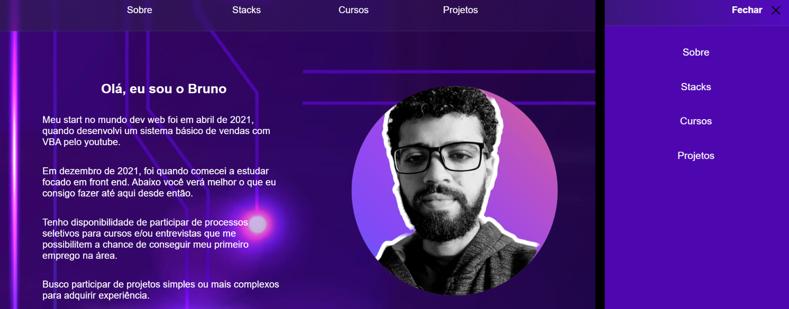

# Meu primeiro portfólio 💓

 

**Criei uma página do zero com base em vários novos truques.** 👋👋
 

 

## Aprendizados 💡💡

 

- Cabeçalho fixado com filtro de fundo transparente.
- Aplicando responsividade e foco em UI e UX design.
- Criando uma seção dinâmica na área dos projetos para que somente a prévia em vídeo do projeto que recebeu o clique.
- Iniciando com display grid.
- Usando transform Css para criar eventos com animações em toda a página.

 

## Acesso ⬇⬇

 

> [Link para a página aqui](https://brunobatista01.vercel.app/) ✅✅

 

## Contato ✉

> Para dúvidas, críticas ou sugestões, me envie um [Email](mailto:brunoornelio@hotmail.com).
